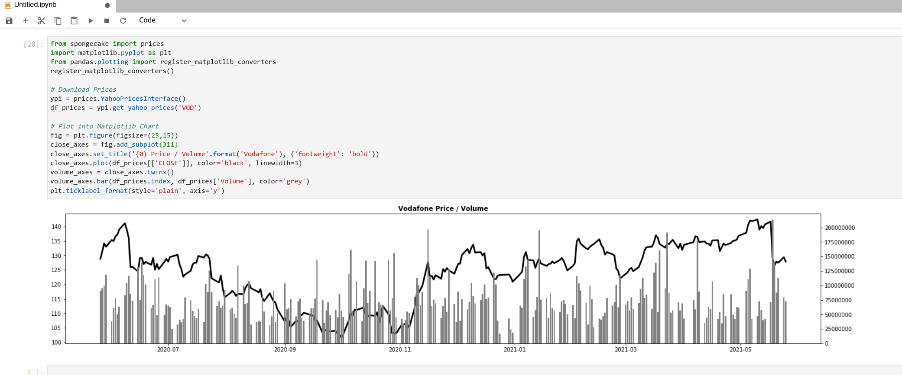
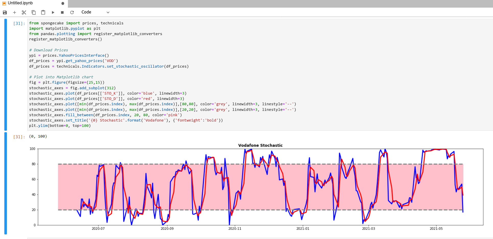

# Spongecake Financials

- [Introduction](#introduction)
  - [Caching](#caching)
- [Fundamentals API](#fundamentals-api)
  - [`class InvestorsChronicleInterface`](#class-investorschronicleinterface)
    - [Public Functions](#public-functions)
  - [`class FinancialWebsiteInterface`](#class-financialwebsiteinterface)
    - [Public Functions](#public-functions-1)
- [Prices API](#prices-api)
  - [`class YahooPricesInterface`](#class-yahoopricesinterface)
    - [Public Functions](#public-functions-2)
- [Technicals API](#technicals-api)
  - [`class Indicators`](#class-indicators)
    - [Public Functions](#public-functions-3)

## Introduction

Spongecake Financials is a small working (but largely unfinished) library that screen-scrapes standard fundamental financial data from websites (e.g. income, balance) and pulls it into Pandas Dataframes for further analysis. It also contains functions to calculate some technical indicators (currently just Stochastic and MACD, but it is simple to add more). The library also provides some standard fundamental calculations that may not appear on the website such as Current Ration and EPS.

For example, below the `InvestorsChronicleInterface` object is used to retrieve the balance sheet for Vodafone, a British mobile phone retailer and operator. This data is scraped from the Investors Chronicle website and returned as a Pandas Dataframe.

```
>>> from spongecake import fundamentals
>>> ic = fundamentals.InvestorsChronicleInterface()
>>> ic.get_ic_balance_sheet('VOD')
                                                   2021      2020      2019
Balance Line Item                                                          
Cash And Short Term Investments                 14980.0   20373.0   26649.0
Total Receivables Net                           11357.0   10075.0   11032.0
Total Inventory                                   676.0     585.0     714.0
Prepaid expenses                                    NaN     859.0    1227.0
Other current assets total                          NaN     752.0     195.0
Total current assets                            27013.0   32644.0   39817.0
Property plant & equipment net                  41243.0   39197.0   27432.0
Goodwill net                                    31731.0   31271.0   23353.0
Intangibles net                                 21818.0   22252.0   17652.0
Long term investments                            5595.0    6623.0    4822.0
Note receivable - long term                      4777.0   10378.0    5170.0
Total assets                                   155063.0  168168.0  142862.0
Accounts payable                                18070.0    6650.0    6567.0
Accrued expenses                                    NaN    5817.0    7338.0
Notes payable/short-term debt                       NaN       0.0     873.0
Current portion long-term debt/capital leases    8488.0   11826.0    3397.0
Other current liabilities total                  2153.0    8163.0    7348.0
Total current liabilities                       28711.0   32456.0   25523.0
Total long term debt                            59272.0   62892.0   48685.0
Total debt                                      67760.0   74718.0   52955.0
Deferred income tax                              2095.0    2043.0     478.0
Minority interest                                2012.0    1215.0    1227.0
Other liabilities total                          7169.0    8152.0    4731.0
Total liabilities                               99259.0  106758.0   80644.0
Common stock                                     4797.0    4797.0    4796.0
Additional paid-in capital                     150812.0  152629.0  152503.0
Retained earnings -accumulated deficit        -121587.0 -120349.0 -116725.0
Treasury stock - common                         -6172.0   -7802.0   -7875.0
Unrealized gain -loss                               NaN    1227.0    1227.0
Other equity total                              27954.0   30908.0   28292.0
Total equity                                    55804.0   61410.0   62218.0
Total liabilities & shareholders' equity       155063.0  168168.0  142862.0
Total common shares outstanding                 28224.0   26772.0   27230.0
Treasury shares - common primary issue            593.0    2044.0    1585.0
```

Below, the same `InvestorsChronicleInterface` object is used to retrieve the Price to Earnings Ratio of Vodafone.

```
>>> ic.get_price_to_earnings_ratio('VOD')
8.136184090909092
```

And, finally, the Current Ratio.

```
>>> ic.get_current_ratio('VOD')
0.9408589042527254
```

### Caching

To avoid repeated requests to the website, Spongecake will cache each dataset the first time it is called and for the duration of the program. For instance, in the example above, which retrieved Vodafone Balance Sheet data, the data was cached inside the `InvestorsChronicleInterface` object (`ic`) and subsequent calls to receive it would be serviced from the cache. In fact, the two examples following it (`get_price_to_earnings_ratio()` and `get_current_ratio()`) would have been calculated from the cache, not the website.

## Fundamentals API

### `class InvestorsChronicleInterface`

Main class which provides an interface to the Investors Chronicle website.
 
There are roughly four datasets that can be downloaded:
 
  * Income (Income Sheet details)
  * Balance (Balance Sheet details)
  * Summary (Misc information about the stock)
  * Price (Stock prices)
 
Each section is cached for each stock the first time it's retrieved and never refreshed unless forced. One exception to this is the  Stock price which is cached for a max of 5 mins (default, can be changed in the class). Even then, it is only refreshed if a subsequent call is made to retrieve it.
 
#### Public Functions

The functions, below, all return Pandas Dataframes of data from the Investors Chronicle website.

    def get_ic_income_sheet(self, tidm, market='LSE')
    def get_ic_balance_sheet(self, tidm, market='LSE')
    def get_ic_summary_sheet(self, tidm, market='LSE')

The Share Price function caches it's result for a max (default) of 5 mins.

    def get_current_ic_price(self, tidm, market='LSE')
    
This class also provides a number of functions that will return certain, well-known fundamental calculations. These are all listed below and self-explanatory. See source for docstrings.

    def get_roce_pct(self, tidm, market='LSE')
    def get_shares_outstanding(self, tidm, market='LSE')
    def get_price_to_earnings_ratio_ttm(self, tidm, market='LSE')
    def get_price_to_earnings_ratio(self, tidm, market='LSE')
    def get_eps_ttm(self, tidm, market='LSE')
    def get_eps(self, tidm, market='LSE')
    def get_earnings_yield_pct_ttm(self, tidm, market='LSE')
    def get_earnings_yield_pct(self, tidm, market='LSE')
    def get_total_debt(self, tidm, market='LSE')
    def get_current_ratio(self, tidm, market='LSE')
    def get_nav(self, tidm, market='LSE')
    def get_nav_per_share(self, tidm, market='LSE')
    def get_nav_per_share_as_pct_of_price(self, tidm, market='LSE')
    def get_market_cap(self, tidm, market='LSE')

There are also a couple of miscellaneous public functions to retrieve useful metadata.

    def get_date_of_latest_income_sheet(self, tidm, market='LSE')
    def get_date_of_latest_balance_sheet(self, tidm, market='LSE')

### `class FinancialWebsiteInterface`

Base class for `InvestorsChronicleInterface`. Can be used when building interfaces for additional financial websites.

#### Public Functions

See source for docstrings, but fairly self-explanatory. This class is based on the financial website in question using HTML `<table></table>` tags to present data which is still the case for a number of sites out there.

    def download_web_page(url)
    def extract_tables_from_raw_html(data)
    def get_dataframes_from_html_tables(html_tables, headers=0)

## Prices API

### `class YahooPricesInterface`

This class contains utility functions to download and, in some cases, clean-up Yahoo price data for stocks.

#### Public Functions

    def get_yahoo_prices(self, tidm, market='L', from_date=(date.today() - timedelta(days=365)), to_date=date.today(), force_cache_refresh=False):


An example, below, shows a year's worth of prices for Vodafone, a British mobile phone retailer and operator, being retrieved and returned in a Pandas Dataframe.

```
>>> from spongecake import prices
>>> ypi = prices.YahooPricesInterface()
>>> ypi.get_yahoo_prices('VOD')
                  HIGH         LOW        OPEN       CLOSE       Volume   ADJ CLOSE
Date                                                                               
2020-05-26  132.179993  127.203003  131.839996  128.880005   90312499.0  120.335564
2020-05-27  132.179993  129.279999  130.000000  131.380005   95168695.0  122.669815
2020-05-28  134.919998  131.020004  131.020004  134.139999   99343439.0  125.246841
2020-05-29  136.000000  131.639999  132.800003  133.020004  118088573.0  124.201096
2020-06-01  135.460007  133.759995  134.479996  135.320007   38032479.0  126.348618
...                ...         ...         ...         ...          ...         ...
2021-05-19  130.080002  125.459999  128.720001  126.400002  140647445.0  126.400002
2021-05-20  128.100006  124.879997  126.980003  127.879997   87819785.0  127.879997
2021-05-21  128.320007  125.639999  128.199997  127.480003  112945805.0  127.480003
2021-05-24  130.059998  127.900002  127.900002  129.380005   78984822.0  129.380005
2021-05-25  130.179993  127.160004  129.600006  127.900002   72901625.0  127.900002

[254 rows x 6 columns]
```

The screenshot from Jupyter Notebook, below, shows how this data can be used to plot charts using Matplotlib.



## Technicals API

### `class Indicators`

This class contains static methods which will apply technical calculations to Pandas Dataframes of prices (see `Prices` API). The Dataframes are modified and returned with the indicators added. They can then be plotted into charts (see [Spongecake Autoreport](https://github.com/chris-j-akers/spongecake-autoreport) for this in action)

Note that all methods in this class are currently static, so it does not need to be instantiated.

#### Public Functions

    @staticmethod
    def set_stochastic_oscillator(df_prices, slow_periods=14, fast_periods=3)

    @staticmethod
    def set_macd(df_prices, long_period=26, short_period=3, signal_period=9):


The screenshot from Jupyter Notebook, below, shows how the `set_stochastic_oscillator()` function can be used to plot charts using Matplotlib.

